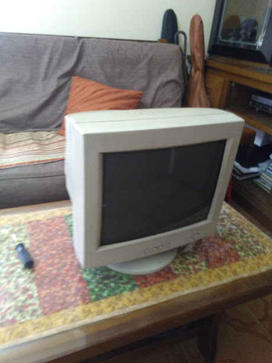
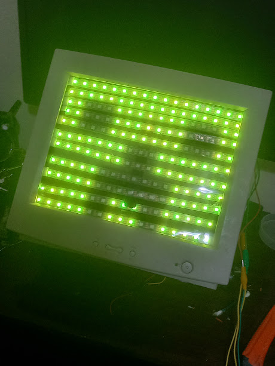
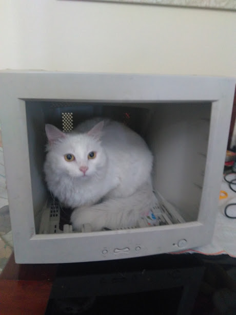

# TVHead

Really old project made for fun. Trying to write with Rust this time I guess.

checkout https://github.com/Day-OS/TVHead/tree/cpp-old to see the original code

Original Hardware             |  Animation Test | Creeper Face
:-------------------------:|:-------------------------:|:-------------------------:
  |  [Link Here](_assets/20220301_023326.mp4) | 

As it uses a Raspberry Pi Pico as the brain, most of the content researched for it came from an [official documentation]([https://link](https://datasheets.raspberrypi.com/pico/getting-started-with-pico.pdf)).

Hope I can finish it this time idk lol

